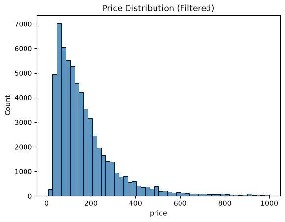
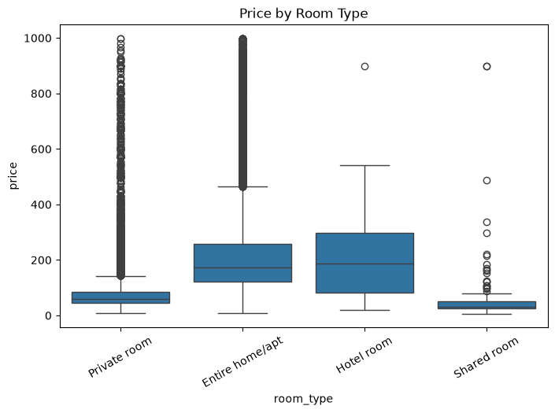
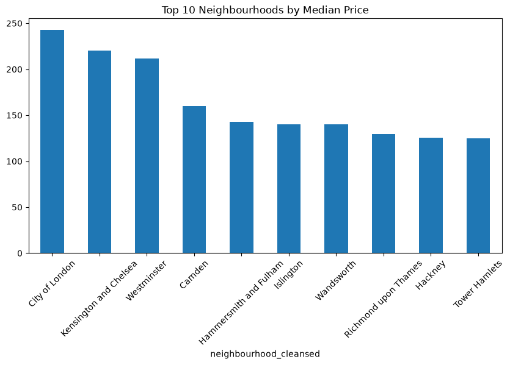
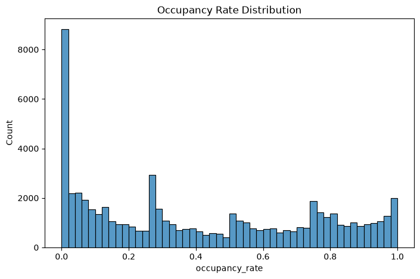
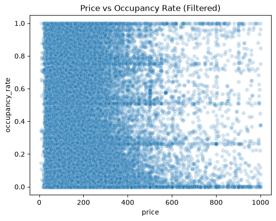
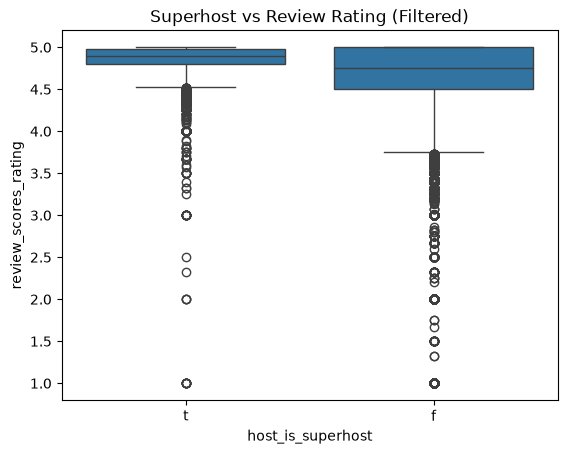
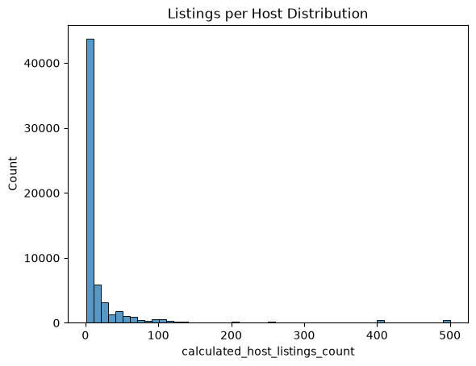

# 🏡 Airbnb London Data Analysis Project


🚀 End-to-end data engineering and analytics project analyzing Airbnb listings in London to uncover insights into pricing, demand, and host behavior.

---

## 📊 Project Overview

This project explores the London Airbnb market using data engineering, exploratory data analysis (EDA), and statistical testing.

The objective is to transform raw Airbnb data into actionable insights for hosts, investors, and marketplace stakeholders.

---

## 🎯 Objectives

- Build a reproducible data pipeline using Python  
- Clean and transform raw Airbnb datasets  
- Perform exploratory data analysis (EDA)  
- Validate findings using statistical methods  
- Generate data-driven business insights  

---

## 📂 Dataset

Data sourced from **Inside Airbnb**, including:

- Listings dataset (core dataset)
- Calendar dataset
- Reviews dataset
- Neighbourhood dataset  

Each listing contains:

- Price  
- Room type  
- Location  
- Host attributes  
- Availability  
- Review scores  

---

## ⚙️ Data Engineering Pipeline

### 🧹 Data Cleaning

- Converted `price` from string to numeric  
- Removed columns with excessive missing values  
- Handled missing values (median imputation / filtering)  
- Dropped listings with missing price  

---

### 🛠 Feature Engineering

Created the following features:

- 📌 **Occupancy Rate** = 1 − (availability_365 / 365)  
- 💰 **Estimated Revenue** = price × occupancy × 365  
- 🛏 **Price per Bedroom**  
- ⏳ **Host Tenure (years)**  

---

## 📊 Exploratory Data Analysis

### 💰 Price Distribution


- Right-skewed distribution  
- Most listings priced between £70–£220  
- Extreme outliers present  

---

### 🏡 Price by Room Type


- Entire homes and hotel rooms are most expensive  
- Private rooms are mid-range  
- Shared rooms are most affordable  

---

### 📍 Neighbourhood Pricing


- Central areas such as City of London and Westminster have highest prices  
- Outer areas are comparatively cheaper  

---

### 📈 Occupancy Distribution


- Many listings have low occupancy  
- Few listings dominate bookings  

---

### 🔵 Price vs Occupancy


- No strong linear relationship  
- Pricing alone does not determine demand  

---

### 🏆 Superhost vs Rating


- Superhosts consistently achieve higher ratings  
- Lower variability compared to non-superhosts  

---

### 🧑‍💼 Listings per Host


- Most hosts operate 1–2 listings  
- Small number of hosts manage many listings  
- Indicates market concentration  

---

## 📐 Statistical Analysis

### ✅ Test 1: Entire Home vs Private Room Pricing
- Test: Mann-Whitney U  
- **Result:** p-value ≈ 0  
- **Conclusion:** Entire homes are significantly more expensive  

---

### ✅ Test 2: Superhost vs Ratings
- Test: Mann-Whitney U  
- **Result:** p-value ≈ 0  
- **Conclusion:** Superhosts have significantly higher ratings  

---

### ✅ Test 3: Neighbourhood Pricing Differences
- Test: ANOVA  
- **Result:** p-value ≈ 0  
- **Conclusion:** Prices differ significantly across neighbourhoods  

---

## 💡 Key Insights

- 💰 Pricing varies significantly by room type and location  
- 📍 Central neighbourhoods command premium prices  
- 📉 Demand is uneven across listings  
- 🏆 Superhosts outperform in ratings and consistency  
- 🧑‍💼 Market supply is concentrated among a small number of hosts  

---

## 🧠 Business Recommendations

### 📊 Pricing Strategy
- Adjust pricing based on room type and neighbourhood  
- Benchmark against similar listings  

### 📈 Demand Optimization
- Improve property quality and responsiveness  
- Focus on increasing positive reviews  

### 🏢 Investment Strategy
- Prioritize high-demand central areas  
- Analyze both occupancy and pricing  

---

## ⚠️ Limitations

- Missing values in some fields  
- Outliers in price data  
- Estimated revenue is an approximation  
- No direct booking data available  

---

## 🚀 Future Work

- Extend analysis to multiple cities  
- Build predictive pricing models  
- Apply time-series forecasting  
- Perform sentiment analysis on reviews  

---

## 🛠 Tech Stack

- Python  
- Pandas  
- NumPy  
- Matplotlib  
- Seaborn  
- SciPy  

---

📁 Project Structure

```
airbnb-data-engineering-project/
│
├── data/
│   ├── raw/                          # Original raw datasets (csv / csv.gz)
│   └── processed/                    # Cleaned & feature-engineered datasets
│
├── notebooks/
│   ├── 01_data_understanding.ipynb   # Initial exploration
│   ├── 02_eda.ipynb                  # Visualizations & insights
│   └── 03_statistical_analysis.ipynb # Hypothesis testing
│
├── src/
│   ├── clean.py                      # Data cleaning pipeline
│   └── features.py                   # Feature engineering pipeline
│
├── requirements.txt                  # Python dependencies
├── README.md                         # Project overview
└── REPORT.md                         # Detailed written report
```

## ⚙️ Setup Instructions

### 1. Clone the repository

```bash
git clone 
cd airbnb-data-engineering-project
```

### 2. Create a virtual environment

```bash
python -m venv .venv
```

Activate it:

**Windows:**
```bash
.venv\Scripts\activate
```

**Mac/Linux:**
```bash
source .venv/bin/activate
```

### 3. Install dependencies

```bash
pip install -r requirements.txt
```

### 4. Run data cleaning

```bash
python src/clean.py
```

### 5. Run feature engineering

```bash
python src/features.py
```

### 6. Open notebooks for analysis

Launch Jupyter:

```bash
jupyter notebook
```

Then open:

Then open, in order:
1. `01_data_understanding.ipynb` — initial exploration
2. `02_eda.ipynb` — visualizations & insights
3. `03_statistical_analysis.ipynb` — hypothesis testing

👤 Author
H F M Ammar
